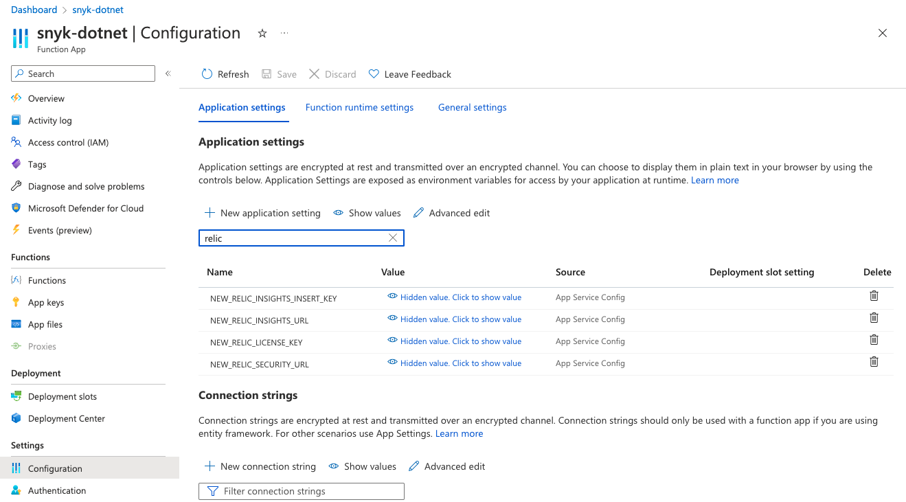
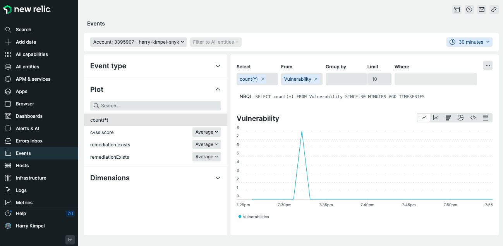
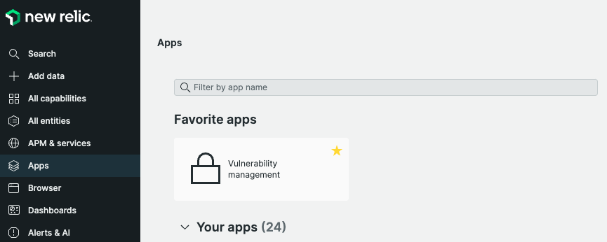
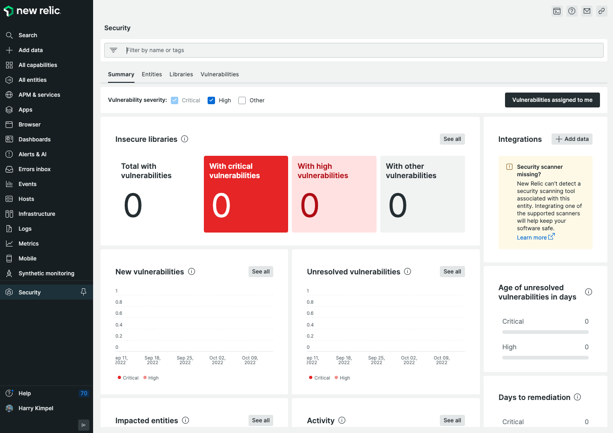
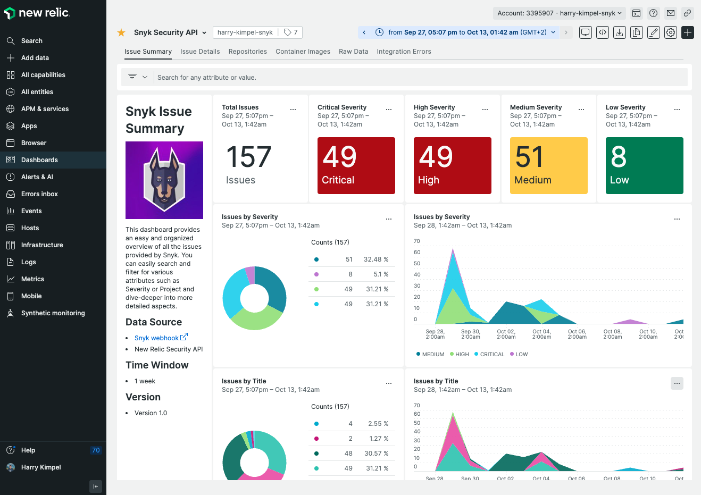

# New Relic Security API using Snyk Webhooks

New Relic Security API is the most recent approach for New Relic to send in any type of security-related information into the New Relic platform. The benefit of using this approach is that New Relic “understands” the type of data being ingested and is then able to provide a curated user interface on the information and also offers a standardized way of correlating this information with other types of data that New Relic is able to consume.

Examples of such correlations are:
- An application that is being monitored using APM (Application Performance Monitoring), the repository where this application resides in and correlated issues Snyk identifies from an application security perspective
- A container that is running inside of a Kubernetes cluster where New Relic knows everything about the runtime behavior and Snyk can provide detailed information about the container security aspects

Please follow the below steps to get this integration between Snyk and New Relic set-up.

# 1. Create an Azure Function App

Please follow the regular process to create and configure an Azure Function App. An example code for the actual Azure Function code can be found in [here](./azure-function-newrelic.cs).

# 2. Configure Azure Function Environment Variables

Go into your Azure Function App Configuration and add the following new application settings:

- NEW_RELIC_SECURITY_URL: URL for the New Relic Security API, i.e. https://security-api.newrelic.com/security/v1
- NEW_RELIC_LICENSE_KEY: New Relic License Key
- NEW_RELIC_INSIGHTS_URL: URL for the New Relic accounts' event API, i.e. https://insights-collector.newrelic.com/v1/accounts/{NR-ACCOUNT-ID}/events
- NEW_RELIC_INSIGHTS_INSERT_KEY: New Relic Insights Insert Key



# 3. Gather Azure Function URL

Select the appropriate Azure Function and copy the Function URL (pls. find below an example for my New Relic Azure Function).


This is the URL you will need for the next step in order to create the Snyk Webhook.

# 4. Create a Snyk Webhook

The Snyk webhook can easily be created using the provided API. The API only requires the Snyk organization ID, the Snyk authentication token and target webhook URL to be provided. An example request may look like this and you can use your favorite tool to actually send the request.

```
POST https://snyk.io/api/v1/org/{SNYK-ORG-ID}/webhooks HTTP/2
Host: snyk.io
Authorization: token {SNYK-TOKEN}
Content-Type: application/json

{
    "url": "https://{URL}",
    "secret": "my-secret-string"
}
```

As a result, you will get a response like this:

```
{
  "id": "{SNYK-WEBHOOK-ID}",
  "url": "https://{URL}",
}
```

You could then use the Snyk Ping API in order to pro-actively trigger the webhook in order to test your integration:

```
POST https://snyk.io/api/v1/org/{SNYK-ORG-ID}/webhooks/{SNYK-WEBHOOK-ID}/ping HTTP/2
Host: snyk.io
Authorization: token {SNYK-TOKEN}
Content-Type: application/json
```

# New Relic Curated UI and Snyk Custom Dashboard

Once the Azure Function as well as the Snyk webhook are created, you should see data coming in for Snyk projects with a configured retest frequency or rather projects that you scan manually and where Snyk identifies new issues.

You should be able to look into the Vulnerability event type to validate that data flows into New Relic.



In addition to that, New Relic also provides a curated UI, a New Relic app named Vulnerability Management, that you can use to visualize all the issues being sent.





Furthermore, the Snyk team has also built a quickstart template that includes a sample custom dashboard to make sure all the data is presented in a Snyk-focused way.

