# Snyk-to-Splunk integration using the Splunk HTTP-Event-Collector
Connect Snyk to Splunk by leveraging the Splunk HTTP Event Collector and visualise your vulns to Splunk.   

## Useful resources   
I recommend the following resources:
- Forward Snyk Vulnerability data [to Splunk Observability Cloud](https://www.kimpel.com/post/forward-snyk-vuln-data-to-splunk/), *(Harry Kimpel)* 
- Snyk [webhook subscription](https://github.com/harrykimpel/snyk-webhook-subscription/), *(Harry Kimpel)*
- [Using Snyk Webhooks to connect Snyk](https://docs.snyk.io/snyk-api-info/snyk-webhooks/using-snyk-webhooks-to-connect-snyk-to-slack-with-aws-lambda) to Slack with AWS Lambda, *(Fredrik Klasén, Eric Fernandez)*

## Prerequisites
- An AWS account with access to:<br/>
	- Create new roles (or use an existing one)<br/>
	- Modify Lambda functions<br/>
	- Modify API Gateway<br/>
- Snyk account with Organization Admin access<br/>
- Splunk Clound account - note: **not the same** as Splunk Observability Cloud!<br/>

## List of content
- [1. Splunk Setup](#1-splunk-setup)<br/>
	- [1.1 Setting up the HTTP Event Collector in Splunk Cloud](#11-setting-up-the-http-event-collector-in-splunk-cloud)<br/>
	- [1.2 Generate a UUID for the Splunk connection (X-Splunk-Request-Channel)](#12-generate-a-uuid-for-the-splunk-connection-x-splunk-request-channel)<br/>
	- [1.3 Test our Splunk connection](#13-firetest-our-splunk-connectionfire)<br/>
- [2. AWS Setup](#2-aws-setup)<br/>
	- [2.1 Create a new IAM role (upfront) for the AWS Lambda function](#21-create-a-new-iam-role-upfront-for-the-aws-lambda-function)<br/>
	- [2.2 Create a Lambda function](#22-create-a-lambda-function)<br/>
	- [2.3 Setting the necessary environment variables](#23-setting-the-necessary-environment-variables-for-our-aws-lambda-function)<br/>
	- [2.4 Setting up the Lambda trigger](#24-setting-up-the-lambda-trigger)<br/>
	- [2.5 Configuring the API Gateway](#25-configuring-the-api-gateway)<br/>
		- [2.5.1 Setting up the method](#251-setting-up-the-method)<br/>
		- [2.5.2 Deploying the POST method](#252-deploying-the-post-method)<br/>
	- [2.6 Time to test our AWS Lambda function](#26-fire-time-to-test-our-aws-lambda-function-fire)<br/>
- [3. Snyk Webhook Setup](#3-snyk-webhook-setup)<br/>
- [4. Get and display code issues](#4-get-and-display-code-issues)<br/>

## 1. Splunk Setup
To start with, we will set up and configure the Splunk HTTP Event Collector and test our connection before moving to AWS Lambda.<br/>  

### 1.1 Setting up the HTTP Event Collector in Splunk Cloud    
Our intention is to get data in Splunk Cloud via monitoring. We'll leverage the Splunk HTTP Event Collector, which is an endpoint that lets developers send application events directly to the Splunk platform via HTTP or HTTPS using a token-based authentication model.<br/>  
It's a handy solution, because we can use the Splunk .NET and Java logging libraries or any standard HTTP Client that lets us send data in JavaScript Object Notation (JSON) format.<br/>       
The HTTP Event Collector receives data over HTTPS on TCP port 8088 by default. We can change this port, as well as disable HTTPS.<br/>  

<details>
<summary><b>:hammer_and_wrench: Implementation steps</b></summary>
<br/>
1. Log in to your <b>Splunk Cloud account</b> (you receive the login information via email, like the Splunk Cloud Platform URL, the Username and a Temporary Password)<br/>
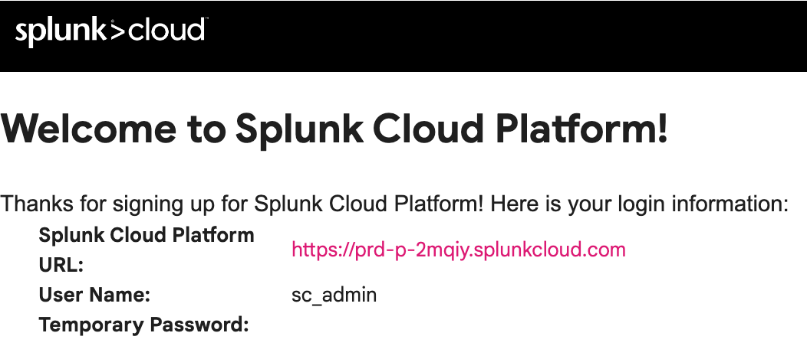<br/><br/>
2. After a succesful log in, navigate to <b>Settings</b> in the top menu bar and select the Add Data icon!<br/>
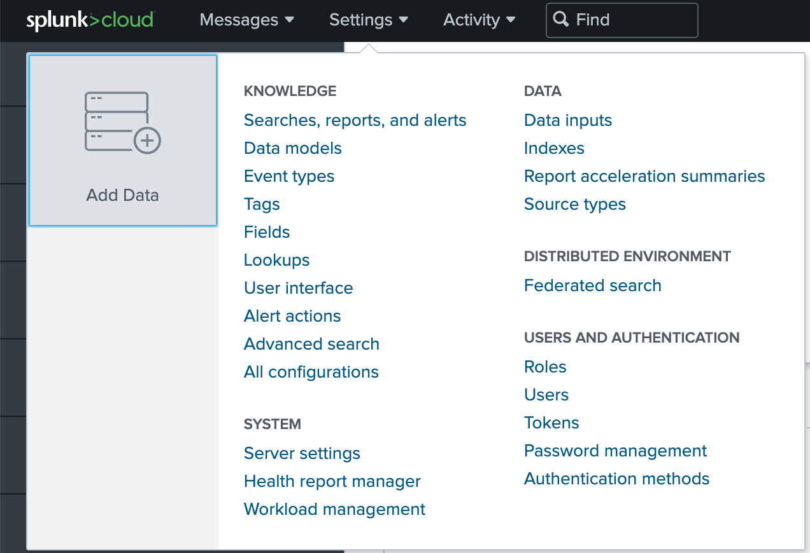<br/><br/>
3. In the <b>Or get data in with the following methods </b> section choose Monitor<br/><br/>
4. Among the many options choose <b>HTTP Event Collector</b><br/><br/>
5. Give a name for your Token and make sure that the option <b>Enable indexer acknowledgement</b> is selected!<br/>
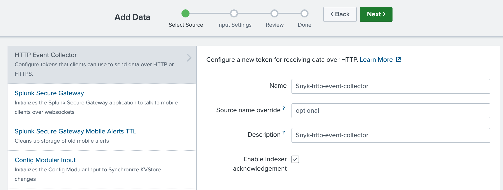<br/><br/>
6. On the Input Settings site the source type should be <b>automatic</b>, and we can allow the <b>main </b>index (The Splunk platform stores incoming data as events in the selected index):<br/>
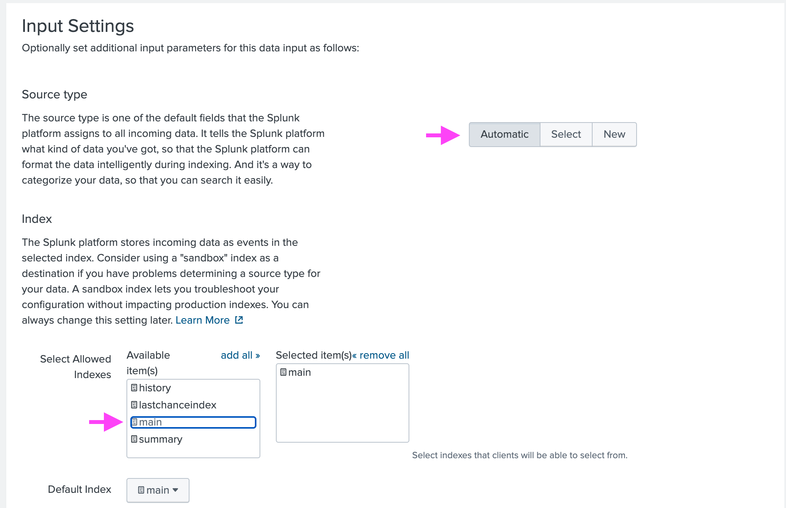<br/><br/>
7. After reviewing all the information, we're done, you should see the generated Token Value (in this setup on AWS Lambda it is called <b>SPLUNK_HEC_TOKEN</b>):<br/>
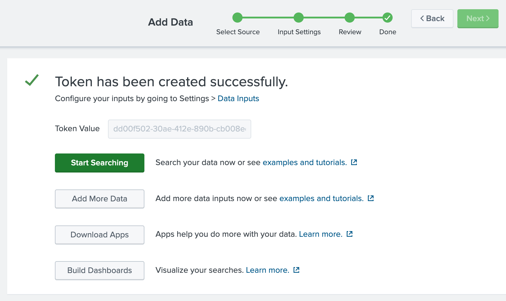<br/><br/>
</details>

### 1.2 Generate a UUID for the Splunk connection (X-Splunk-Request-Channel)
[Sending events to HEC with indexer acknowledgment](https://docs.splunk.com/Documentation/Splunk/9.0.1/Data/AboutHECIDXAck) active is similar to sending them with the setting off. There is one crucial difference: when you have indexer acknowledgment turned on, you must specify a channel when you send events.<br/>
The concept of a channel was introduced in HEC primarily to prevent a fast client from impeding the performance of a slow client. When you assign one channel per client, because channels are treated equally on Splunk Enterprise, one client can't affect another.<br/>

In order to We need a unique identifier which we can generate for example [here](https://www.guidgenerator.com/online-guid-generator.aspx), this will make our communication unique by using this globally unique component (in this case message) identifiers.<br/>
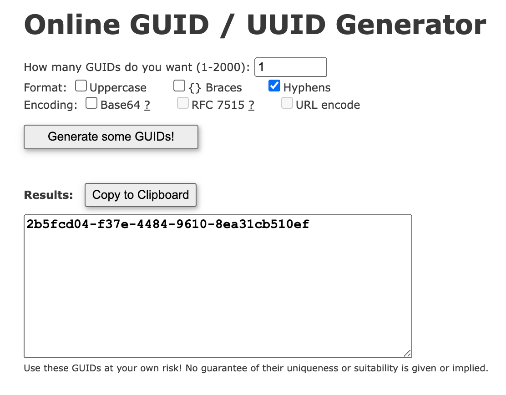<br/>

### 1.3 :fire:Test our Splunk connection:fire: 
To test our Splunk connection, we will use <b>Postman</b> this time (feel free to use your own API platform to interact with Splunk).      
I recommend to create a new collection in Splunk, and put all the requests there.

<details>
<summary><b>:hammer_and_wrench: Test steps</b></summary>
Parameters of the <b>POST</b> request:
- As a URL, let's use ``` https://prd-p-2mqiy.splunkcloud.com:8088/services/collector ```
- Authorization type: <b>No Auth</b>
- Headers:
	- Content-Type: <b>application/json</b>
	- Authorization: <b>Splunk \<your-splunk-token\></b>
	- X-Splunk-Request-Channel: <b>\<the generated UUID\></b><br/>

It should look like:     
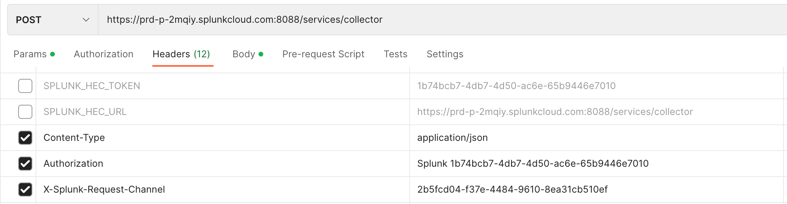<br/>
- Body: Let's just use a short sentence as an <b>httpevent</b>, like:
```json
{
    "event": "Let's ping Splunk", 
    "sourcetype": "httpevent"
}	
```
It should look like:     
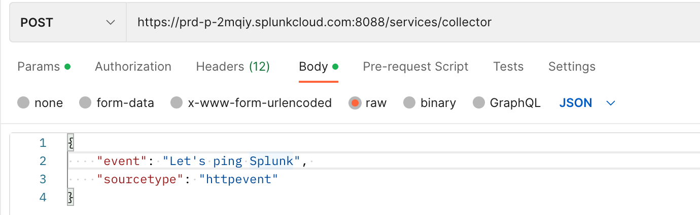<br/>

After sending the POST request, we should see in Postman:       
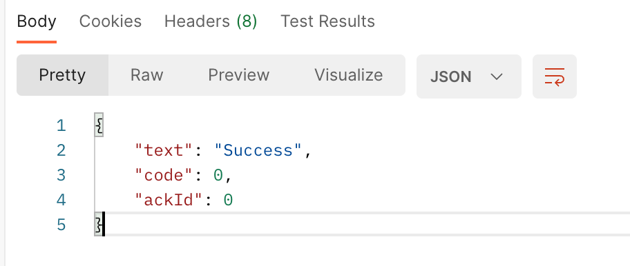<br/>
	
We need to navigate to the Search & Reporting site in Splunk Cloud (right menu pane):      
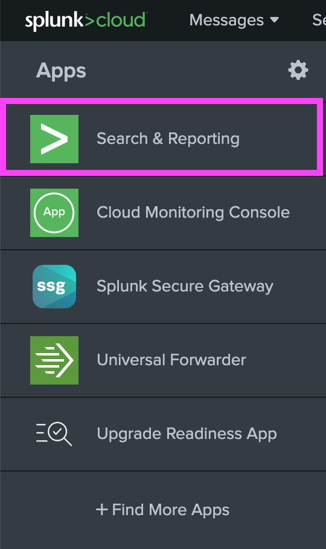<br/>

We shall start a new search, into the search field we need to enter ``` source="http:<name-of-your-http-event-token>" (index="main")```.      
Fortunately we turned on the indexing option when setting up the HTTP Event Collector, now it's easy to find our messages.<br/><br/>
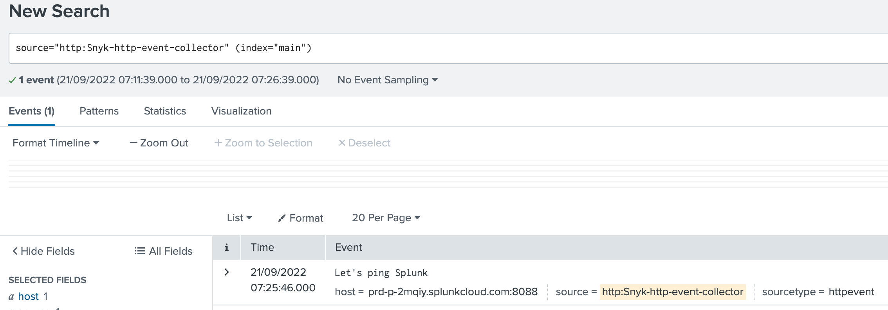<br/>

As we can see, Splunk successfully received our message. Now we can set up and configure our AWS Lambda finction.    
</details>
	
## 2. AWS Setup
In this section, I'll show you how to configure AWS in order to send data towards Splunk, as well as the background of the 5 implementation steps.

Note: The AWS Lambda function and the API Gateway have to be configured in the same region.   
We are going to use AWS Lambda, because it's a relatively cost-effective and efficient way to run code on events, for example when there is a new Snyk vulnerability.

### 2.1 Create a new IAM role (upfront) for the AWS Lambda function
To start with, we need to create an IAM role that we can assign to the AWS Lambda function. We need to provide basic execution roles and permissions to invoke an API Gateway which we'll be interacting with. If you're interested in the implementation, click below.  
<details>
<summary><b>:hammer_and_wrench: Implementation steps</b></summary>
<br/>
	<table border="0">
		<tbody>
			<tr>
				<td> 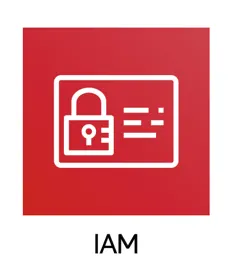</td>
				<td>
1. Go to the AWS Console<br/><br/>
2. Navigate to <b>IAM</b><br/><br/>
3. Click on <b>Roles/Create role</b><br/><br/>
4. Select for Trusted entity type: <b>AWS Service</b>, for Use case: <b>Lambda</b>, then click on Next<br/><br/>
5. Search for <b>AmazonAPIGatewayInvokeFullAccess</b> (we'll be interacting with the API Gateway) and <b>AWSLambdaBasicExecutionRole</b> among the Permissions policies, then click on Next.<br/><br/>
6. Add a (custom) name for the role, then click on <b>Create role</b><br/>
				</td>
			</tr>
		</tbody>
	</table>
<b>Note:</b> automatically created roles in AWS Lambda will restrict the "Resources", instead of  

```
"Resource": "*"
```
You will see something like:
```json
{
    "Version": "2012-10-17",
    "Statement": [
        {
            "Effect": "Allow",
            "Action": "logs:CreateLogGroup",
            "Resource": "arn:aws:logs:us-west-2:880724394176:*"
        },
        {
            "Effect": "Allow",
            "Action": [
                "logs:CreateLogStream",
                "logs:PutLogEvents"
            ],
            "Resource": [
                "arn:aws:logs:us-west-2:880724394176:log-group:/aws/lambda/Splunk:*"
            ]
        }
    ]
}
```
</details>

You can check, your roles should look like these (AWS build-in roles)

```json
//AmazonAPIGatewayInvokeFullAccess
{
    "Version": "2012-10-17",
    "Statement": [
        {
            "Effect": "Allow",
            "Action": [
                "logs:CreateLogGroup",
                "logs:CreateLogStream",
                "logs:PutLogEvents"
            ],
            "Resource": "*"
        }
    ]
}
```


```json
//AWSLambdaBasicExecutionRole
{
    "Version": "2012-10-17",
    "Statement": [
        {
            "Effect": "Allow",
            "Action": [
                "execute-api:Invoke",
                "execute-api:ManageConnections"
            ],
            "Resource": "arn:aws:execute-api:*:*:*"
        }
    ]
}
```

### 2.2 Create a Lambda function
---
:genie: **The fastest and most convenient way is to go to [Splunk's development site](https://dev.splunk.com/enterprise/docs/devtools/httpeventcollector/useawshttpcollector/createlambdafunctionnodejs/) and create a Lambda function using a Splunk blueprint:** select the ["splunk-logging" blueprint option](https://dev.splunk.com/enterprise/docs/devtools/httpeventcollector/useawshttpcollector/createlambdafunctionnodejs), or click [here to immediate action within AWS Lambda](https://console.aws.amazon.com/lambda/home?#/create/configure-triggers?bp=splunk-logging)

---

Alternatively, of course we can create own our JavaScript code as described below.
<details>
<summary><b>:hammer_and_wrench: Implementation steps</b></summary>
<br/>
	<table border="0">
	<tbody>
		<tr>
			<td> </td>
			<td>
1. Go to the AWS Console<br/><br/>
2. Navigate to <b>Lambda</b><br/><br/>
3. Click on <b>Create function</b><br/><br/>
4. Choose <b>Node.js 16.x</b> for the Runtime<br/><br/>
5. <b>x86_64</b> for the architecture<br/><br/>
6. Attach the previously created <b>role</b> ("Use an existing role") to the Lambda function<br/>
(you can also create a new role, but make sure that you attach the <b>AmazonAPIGatewayInvokeFullAccess policy</b> in IAM to it afterwards)<br/><br/>
8. Click on <b>"Create function"</b><br/><br/>
9. From the official <a href="https://dev.splunk.com/enterprise/docs/devtools">Splunk Devtools site</a> you can choose a language and find a logging script from the officially maintained scripts. You can find an <b>official, but from Snyk not maintained example script</b> here (last checked: 28.09.2022) "<a href="https://github.com/mcsnyk/Snyk-to-Splunk-HTTP-Event-Collector/blob/main/scripts/example_splunk_connecting/splunk-logging.js">splunk-logging.js"</a> file! They are <b>automatically generated</b> when using the <a href="https://dev.splunk.com/enterprise/docs/devtools/httpeventcollector/useawshttpcollector/createlambdafunctionnodejs/">official Splunk blueprint.</a><br/>  
			</td>
		</tr>
	</tbody>
</table>

The configuration should look like this:
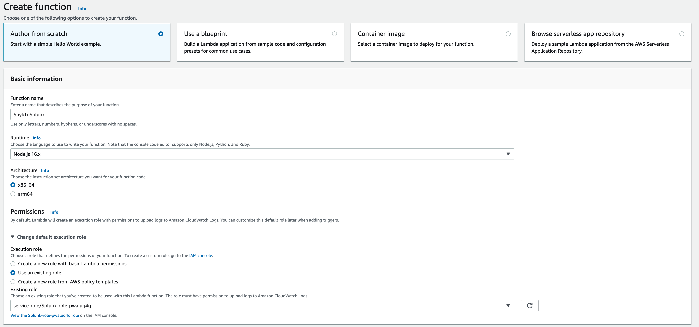
</details>

### 2.3 Setting the necessary environment variables for our AWS Lambda function
In order to interact with Splunk and the Splunk HTTP event collector, we need to set two environment variables in AWS Lambda:

**SPLUNK_HEC_URL**: URL address for your Splunk HTTP event collector endpoint.
Default port for event collector is 8088. <br/>An example can be: <br/>

```
https://host.com:8088/services/collector
```
	
**SPLUNK_HEC_TOKEN**: Token for your Splunk HTTP event collector.
To create a new token for this Lambda function, refer to the [Splunk Docs.](http://docs.splunk.com/Documentation/Splunk/latest/Data/UsetheHTTPEventCollector#Create_an_Event_Collector_token)<br/>
   

<details>
<summary><b>:hammer_and_wrench: Implementation steps</b></summary>
<br/>
1. Go to <b>Configuration</b> in your AWS Lambda<br/><br/> 
2. Click on <b>Environment</b> variables<br/><br/>
3. Add new environment variables (if you created the Lambda function on your own and didn't use the Splunk blueprint): <br/>
<b>SPLUNK_HEC_TOKEN</b> and <b>SPLUNK_HEC_URL</b>.<br/><br/>
- We have already generated our <a href="https://github.com/mcsnyk/Snyk-to-Splunk-HTTP-Event-Collector/blob/main/README.md#11-setting-up-the-http-event-collector-in-splunk-cloud">Splunk Token</a> which we can use now.<br/><br/>
- When configuring the URL we need to pay attention to the <a href="https://community.splunk.com/t5/Getting-Data-In/What-is-the-URI-for-HTTP-Event-Collector-for-Splunk-Cloud/m-p/425704">following configurations.</a>


In our setup, the HEC URL is going to look like:
```
https://prd-p-2mqiy.splunkcloud.com:8088/services/collector?channel=2b5fcd04-f37e-4484-9610-8ea31cb510ef
```
You might ask, why we need the ``` ?channel=2b5fcd04-f37e-4484-9610-8ea31cb510ef ``` part in the URL, you can find an explanation [here](https://cultivatingsoftware.wordpress.com/2018/07/24/splunk-hec-gotcha/) and [here](https://community.splunk.com/t5/Splunk-Enterprise/Why-am-I-getting-error-quot-Data-channel-is-missing-quot-using/td-p/280621).

The settings should look like this:<br/>
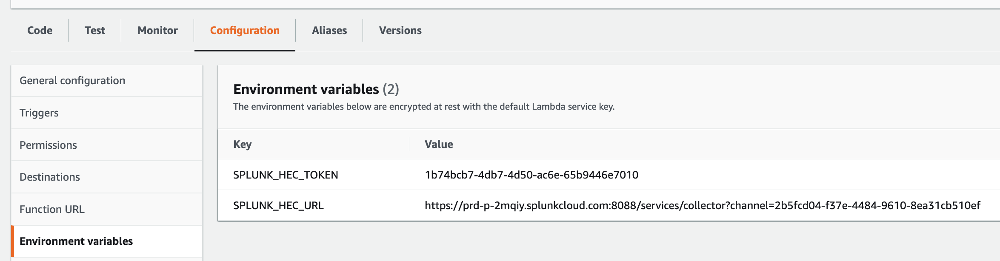<br/>
</details>


### 2.4 Setting up the Lambda trigger
Our goal is to have the Lambda function triggered by a Snyk webhook. To do this we are going to use the API Gateway provided by AWS to trigger the Lambda every time a new event is received.

<details>
<summary><b>:hammer_and_wrench: Implementation steps</b></summary>
<br/>
<table border="0">
	<tbody>
		<tr>
			<td> 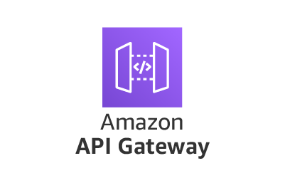</td>
			<td>
1. Go to the AWS Console if you are not there, pay attention to be in the right region!<br/><br/>
2. Navigate to the function and click on Add Trigger<br/><br/>
3. Select API Gateway as trigger<br/><br/>
4. Configure the API Gateway: create a <b>new</b> API (Intent), a <b>REST API</b> with an <b>API key</b> as for the security mechanism. Give the API a <b>name</b>, and select <b>default</b> as the name of the deployment stage.   
			</td>
		</tr>
	</tbody>
</table>
      
The settings should look like this:<br/>
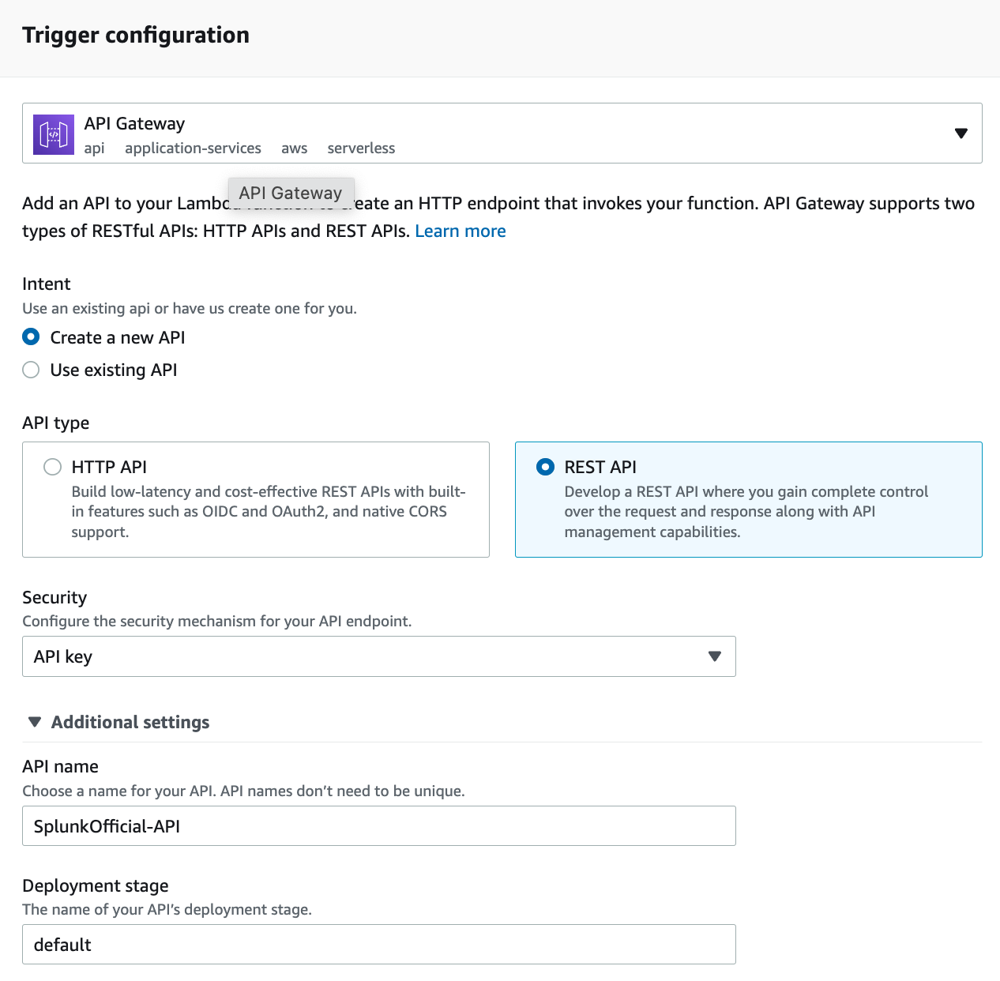<br/>
</details>

### 2.5 Configuring the API Gateway
#### 2.5.1 Setting up the method
The payload we are going to receive is going to have a message, so we want to create a POST method that will receive the message and verify it is a valid message and then send onwards to the Lambda.<br/>

<details>
<summary><b>:hammer_and_wrench: Implementation steps</b></summary>
<br/>
<table border="0">
	<tbody>
		<tr>
			<td> 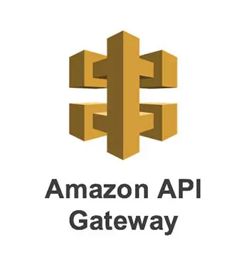</td>
			<td>
Steps to add the POST Method:<br/><br/>
1. Navigate to the API Gateway you have created<br/>
2. Click on Resources<br/>
3. We are going to create the method so go to Actions -> Create Method -> <b>POST</b><br/>
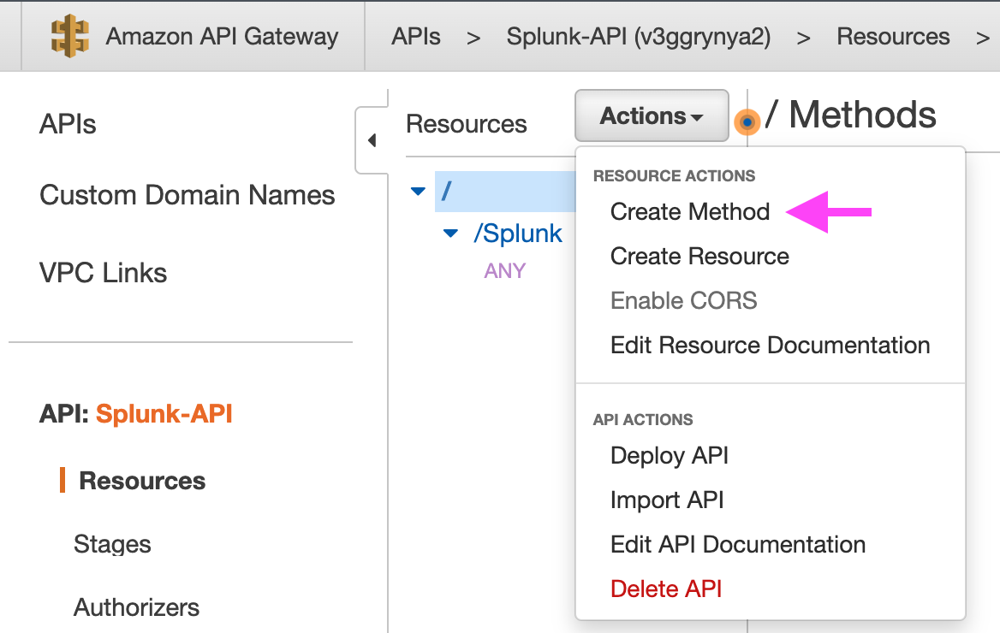<br/><br/>
4. Configure it to work with the Lambda Function you created by adding it to the Lambda Function box<br/>
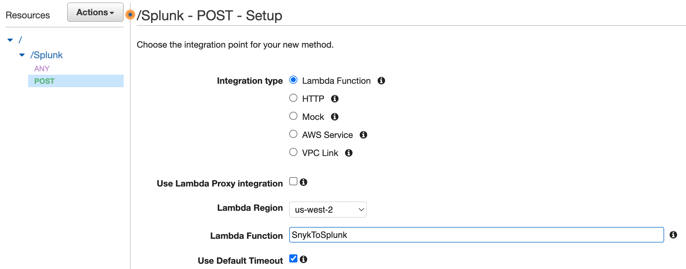<br/><br/>
5. Click on the new <b>POST</b> method<br/>
6. Go to the top right and click on <b>Integration Request</b><br/>
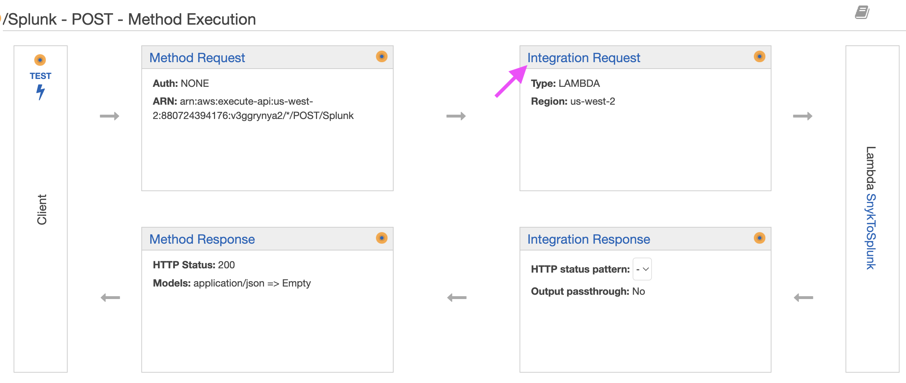<br/><br/>
7. Scroll to the bottom and add a mapping template with application/json Content type.<br/>
			</td>
			</tr>
		</tbody>
	</table>
</details>
	
<details>
<summary><b>:hammer_and_wrench: Mapping template code</b></summary>
<br/>
To the template add the following code:	
	
```
{
    "method": "$context.httpMethod",
    "body" : $input.json('$'),
    "headers": {
        #foreach($param in $input.params().header.keySet())
        "$param": "$util.escapeJavaScript($input.params().header.get($param))"
        #if($foreach.hasNext),#end
        #end
    }
}
```

Check if the mapping template and the code looks like this:
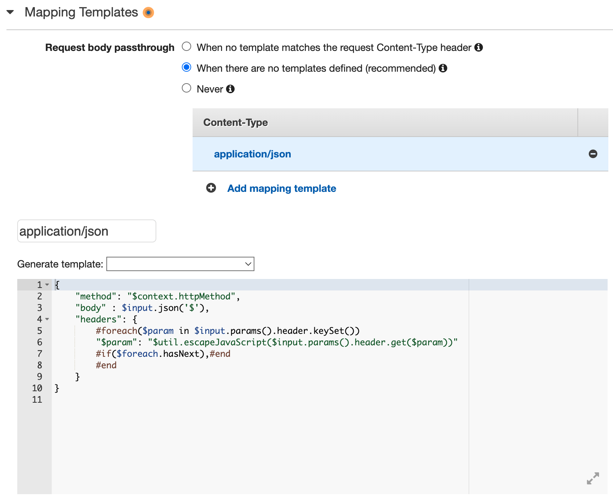<br/>
</details>

#### 2.5.2 Deploying the POST method
With the POST method configured now we want to deploy these changes so our Lambda can start receiving the information.<br/>

<details>
<summary><b>:hammer_and_wrench: Implementation steps</b></summary>
<br/>
Steps to deploy the POST method:<br/>
1. Go to Resources<br/>
2. Click on POST<br/>
3. Then on Actions click on <b>Deploy API</b><br/>
<br/><br/>
4. Then select the Deployment stage to deploy the new API to, in this case we can use the <b>default stage</b><br/>
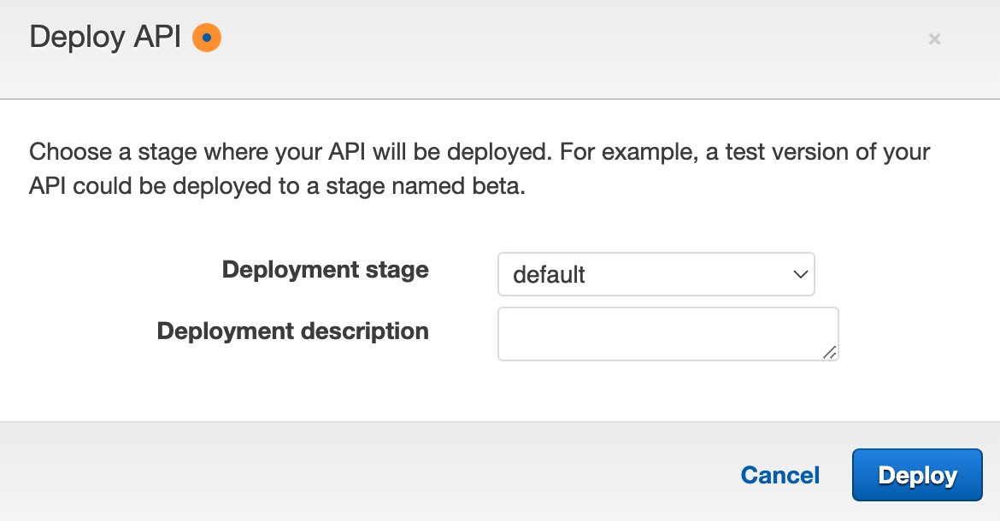<br/><br/>
5. We have to navigate back to AWS Lambda<br/>
6. In the Lambda trigger configuration, you should see a new API endpoint. Copy this endpoint as we will need it when setting up the Snyk webhook<br/>
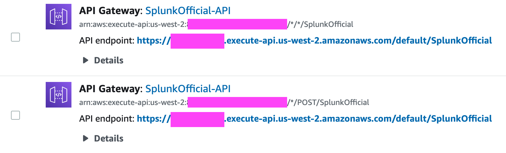<br/><br/>
With the API endpoint saved we can now set up the Snyk webhook<br/>
</details> 

### 2.6 :fire: Time to test our AWS Lambda function :fire:
To test our AWS Lambda function, we will use <b>Postman</b> this time, as well (feel free to use your own API platform to interact with Splunk and AWS Lambda).       
	
It is really easy to test our AWS Lambda endpoint. Since we have already configured Splunk and established a connection between AWS and Splunk, if we trigger our AWS Lambda, it will also appear in Splunk.     

<details>
<summary><b>:hammer_and_wrench: Test steps</b></summary>
As a <b>POST</b> request we can send a short message to AWS.
- AWS Lambda endpoint: we have already configured, [see instructions here](#252-deploying-the-post-method)
- <b>Headers:</b> Content-Type: application/json; charset=utf-8
- <b>Body:</b> 

```json
{
    "event": "Snyk is great! Test message from Postman -> Lambda", 
    "sourcetype": "httpevent"
}
```

What we expect is the callback message from AWS Lambda:     

```
callback("Snyk is great! Test message from AWS Lambda -> Postman", event.key1);     
```

Let's check Postman:<br/>
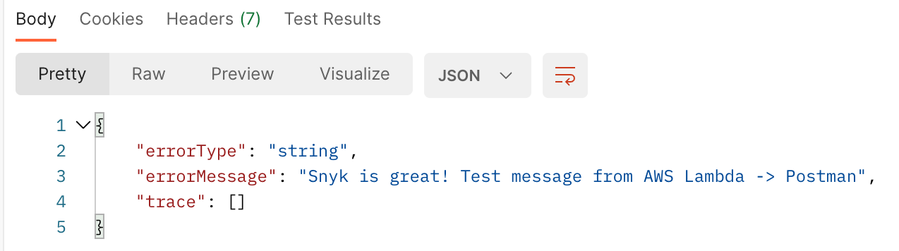<br/><br/>

Let's check Splunk (Search & Reporting):<br/>
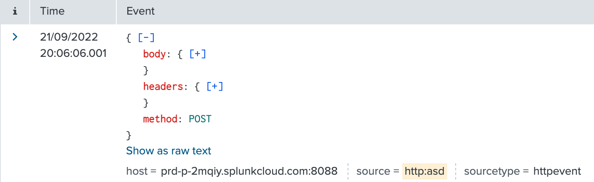<br/>
If we open the <b>body</b> and <b>headers</b> fields in the message:<br/>
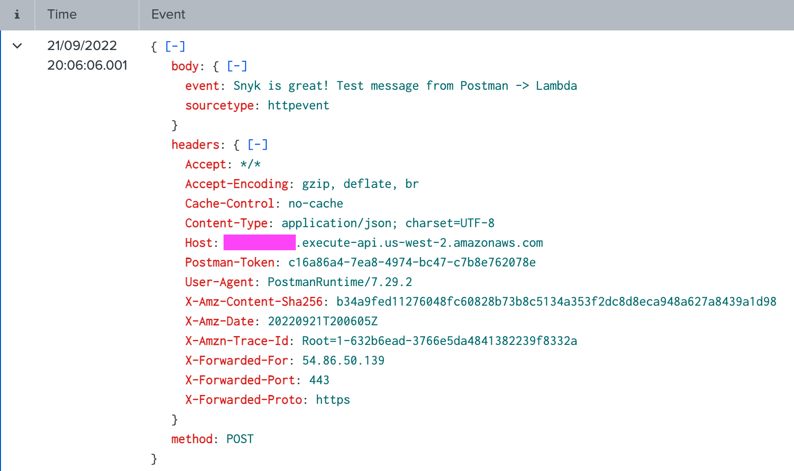<br/>
</details>

## 3. Snyk Webhook Setup
To set up the Snyk webhook we are going to use the [Snyk API v1](https://snyk.docs.apiary.io/#reference/webhooks/webhook-collection/create-a-webhook) 
and the inbuilt console of Apiary to do this request. With this request done your connection from Snyk to Slack will be completed and every time there is a new vulnerability you will get a new notification!    

[Follow the instructions](https://docs.snyk.io/snyk-api-info/snyk-webhooks/using-snyk-webhooks-to-connect-snyk-to-slack-with-aws-lambda/set-up-the-snyk-webhook) to set up a Snyk Webhook!

Let's test the connection: let's retest a project in your selected Snyk org!<br/>
If we go in Splunk to Search & Reporting >> Dashboards, we can check if we receive the new vulnerabilities (raw data and number of H severity vulnerabilities):
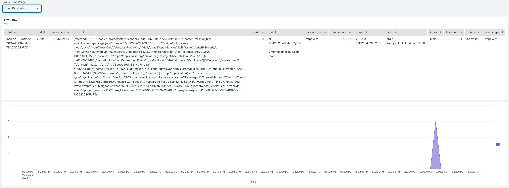<br/>

## 4. Get and display code issues   
At the moment it only works in two steps:   
- We have to pull code issues (of a given Snyk Project) vial the Snyk REST API. Make sure to use the [right version of the API **(2022-04-06~experimental)**](https://apidocs.snyk.io/?version=2022-04-06%7Eexperimental#get-/orgs/-org_id-/issues)<br/>

```
curl --request GET "https://api.snyk.io/rest/orgs/{orgID}/issues?project_id={projID}&severity=high&type=code&version=2022-04-06%7Eexperimental" \
--header "Accept: application/vnd.api+json" \
--header "Authorization: Token {your Snyk Token}" | tee code_results.json
```

- Then we have to create a POST request to send the pulled data towards AWS Lambda: 
```
curl --location --request POST 'your AWS Lambda endpoint' \
--header 'Content-Type: application/json' \
--data @code_results.json
```
      
Feel free to use the scripts [**rest-get-code-issues.sh**](https://github.com/mcsnyk/Snyk-to-Splunk-HTTP-Event-Collector/blob/main/scripts/Rest-API-get-code-issues/rest_api_code_issues.sh) and [**rest-get-code-issues.py**](https://github.com/mcsnyk/Snyk-to-Splunk-HTTP-Event-Collector/blob/main/scripts/Rest-API-get-code-issues/rest-get-code-issues.py)

We can create dashboards like this in Splunk:<br/>
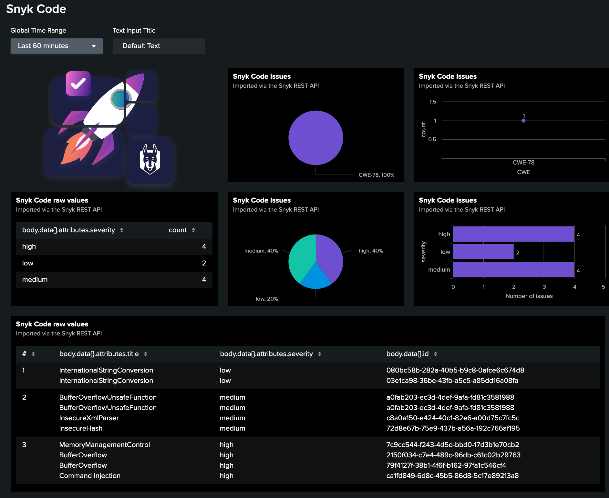<br/>
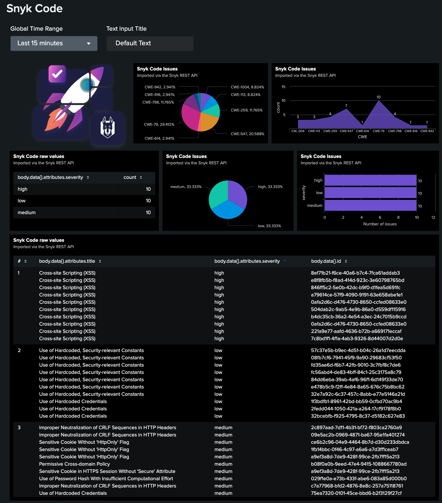<br/>
