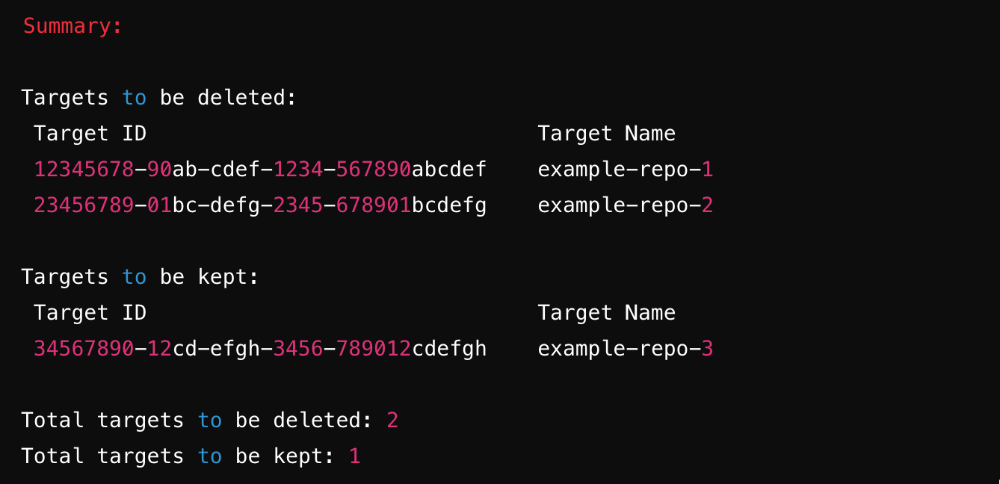

# SnykTargetCleaner

## Overview

SnykTargetCleaner is a Python script designed to help you bulk delete Snyk targets that have no associated projects. It provides a dry run mode to safely simulate deletions and generates a summary report of which targets will be deleted and which will be retained.

### Features

- **Dry Run Mode**: Simulate deletions to review which targets would be removed without making any actual changes.
- **Detailed Summary**: Generates a summary table of targets to be deleted and those to be retained, including their IDs and names.
- **Pagination Handling**: Automatically handles API pagination to ensure all targets and projects are retrieved.
- **Safe Deletions**: Only deletes targets with no associated projects, ensuring important data is preserved.

### Requirements
- Python 3.x
- Requests library: Install via pip install requests
- Pandas library: Install via pip install pandas

### Setup
- Clone the Repository:
 Clone this repository or download the script file directly.

`git clone https://github.com/your-username/cx-tools.git`

- Install Required Dependencies:
 Install the necessary Python libraries using pip:
 `pip install requests pandas`

- Configure the Script:
   Open the script and replace the placeholder values with your actual Snyk API token and organization ID:
```
 SNYK_API_TOKEN = 'your_snyk_api_token'
  ORG_ID = 'your_org_id'
```
### Usage
Dry Run
To simulate the deletion process and see a report of which targets would be deleted, run the script in dry run mode:

`python SnykTargetCleaner.py`

This will output a summary table showing which targets would be deleted and which would be retained.

### Actual Deletion
To perform the actual deletion of targets with no associated projects, run the script with `dry_run=False`:
```
 # Inside the script
 if __name__ == '__main__':
    main(dry_run=False)  # Set dry_run=False to perform actual deletions
 This will delete the targets as indicated in the dry run.
```
### Example Output
When you run the script, you will see a summary like this:


### License
This script is provided under the MIT License. See the LICENSE file for more details.

### Contributing
Contributions are welcome! Feel free to open an issue or submit a pull request if you have suggestions or improvements.

### Disclaimer
Use this script at your own risk. Ensure you understand its behavior by running it in dry run mode before performing any actual deletions.

