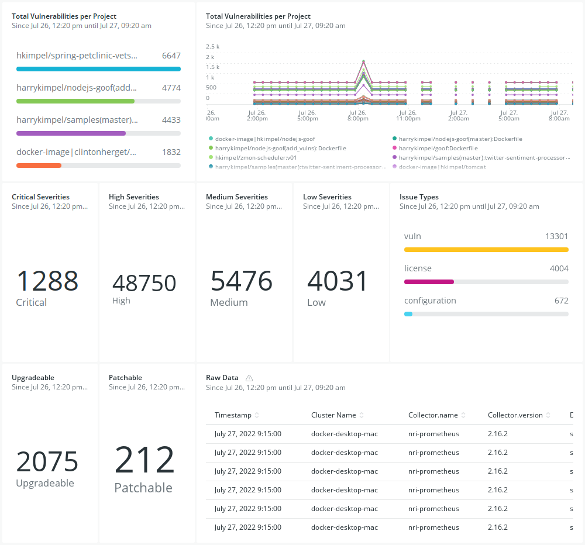

[Snyk Exporter](https://github.com/lunarway/snyk_exporter) is an open source tool that allows for exporting scanning data into Prometheus metrics by scraping the Snyk HTTP API. This Prometheus exporter can easily be deployed into a Kubernetes cluster. This is the scenario described in this article. The exporter could also run outside of Kubernetes in a standalone fashion.

# New Relic observability platform

One example is to leverage New Relic’s Prometheus OpenMetrics integrations for Docker and Kubernetes to scrape Prometheus endpoints and send the data to New Relic, so you can store and visualize crucial metrics on one platform.

Follow these deployment steps:

1. Deploy Snyk exporter
Snyk exporter already contains deployment YAMLs that you can adjust (secrets.yaml contains the API token for your Snyk account) and deploy using:
```
kubectl apply -f examples/secrets.yaml

kubectl apply -f examples/deployment.yaml
```

2. Deploy the New Relic Kubernetes integration
You can use New Relic’s guided install from the UI to configure a custom install and deploy script for the Kubernetes integration. Just make sure to check the option to sScrape all Prometheus endpoints.

3. Visualize these metrics
As soon as you deploy the New Relic Kubernetes integration, you should see metrics from the Snyk exporter flowing in. You don’t need to create your own dashboard to visualize these metrics, but can leverage a [pre-built dashboard](./newrelic_dashboard.json) from this repo to import into your New Relic account.

4. Check out the dashboard
Once the quickstart is ready, you can go to your dashboards section within New Relic and look at the Snyk dashboard that you have imported, visualizing all the metrics from the Snyk exporter. 