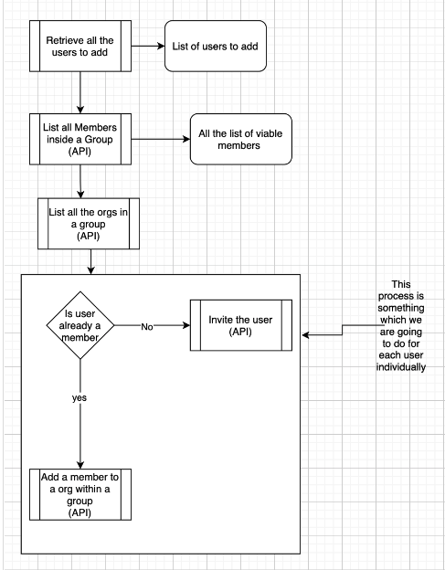

# Assign users to all orgs in a group

## Description

Use this method to assign multiple users to all orgs in a group as group memebers

## Flow and Endpoints

1. Get group level service account token with admin permissions
2. Check if list of users is already a group member or has accepted the invite.
    1. [List all members in a group](https://snyk.docs.apiary.io/#reference/groups/list-members-in-a-group/list-all-members-in-a-group)
3. If not, must invite user to snyk at org level.
    1. [Invite Users](https://snyk.docs.apiary.io/#reference/organizations/user-invitation-to-organization/invite-users)

Note: Check if the email user has accepted (can see by email and user ID from the API call in 2.1 above).  If there’s a user ID then you know they accepted and can move forward. Need to check this every day, few hours, whatever frequency desired (run the API calls over some frequency).

1. [List all organizations in a group](https://snyk.docs.apiary.io/#reference/groups/list-all-organizations-in-a-group/list-all-organizations-in-a-group)

1. Then, iterate over the list of orgs in the group and add user to each org (using user ID) with the [Add a member to an organization within a group api call](https://snyk.docs.apiary.io/#reference/groups/members-in-an-organization-of-a-group/add-a-member-to-an-organization-within-a-group)

## Flow Chart

Decision tree:

