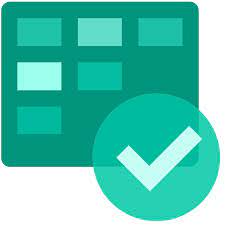
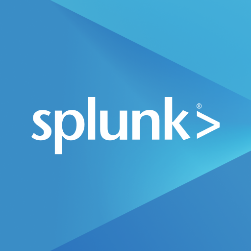

# Snyk webhook subscription

This repository contains some examples on how to subscribe to Snyk notifications and process the information in order to forward these notifications to Microsoft Teams or Azure DevOps Boards.

Please refer to the Snyk docs page for further information about Snyk Webhooks:
- [Snyk Webhook docs](https://docs.snyk.io/features/integrations/snyk-webhooks)
- [Snyk API docs](https://snyk.docs.apiary.io/#reference/webhooks)

Please also note that the webhooks feature is currently in beta. While in this status, Snyk may change the API and the structure of webhook payloads at any time, without notice.

Steps you need to follow in order to set-up this integration:

## 1. Create an Azure Function App in order to receive the webhook from Snyk

Samples provided include Azure Functions for:
-  [Azure DevOps Boards](azure-function-azure-boards.cs)
-  [Microsoft Teams](azure-function-microsoft-teams.cs)
-  [Power BI](azure-function-power-bi.cs)
-  [New Relic Events](azure-function-newrelic.cs)
-  [DataDog](azure-function-datadog.cs)
-  [Slack](https://docs.snyk.io/snyk-api-info/snyk-webhooks/using-snyk-webhooks-to-connect-snyk-to-slack-with-aws-lambda) (This one is using AWS Lambda)
-  [Splunk Observability Cloud](azure-function-splunk.cs)

These are all written in C# in order to process the payload from Snyk and send it to an Azure DevOps Board.

This Azure Functions require the following environment variables to be set-up

### 1.1. Azure DevOps Boards work items to be created:


Please speficy the below application settings:

- AZURE_DEVOPS_ORG: the name of the Azure DevOps organisation
- AZURE_DEVOPS_PROJECT: (optional) the Azure DevOps project to create work items for, by default the code will map to the same project that it identified in Snyk
- AZURE_DEVOPS_USER: the Azure DevOps user name
- AZURE_DEVOPS_PAT: the Azure DevOps personall access token
- AZURE_DEVOPS_API_VERSION: the Azure DevOps API version to use, e.g. "7.1-preview.3"

For more information on how to create work items in Azure DevOps Boards, see this [docs page](https://docs.microsoft.com/en-us/rest/api/azure/devops/wit/work-items/create?view=azure-devops-rest-7.1).

This integration also supports the use case of specifying a specific Azure Boards project per Snyk organization. If you want to leverage this, then please speficy the below application settings:

- AZURE_DEVOPS_SNYKORG_BOARDS_MAPPING: a JSON representation of the mapping for Snyk orgs to Azure Boards projects, format: [{"snykOrgId": "SNYK_ORG_ID", "azureBoardsProject": "AZURE_BOARDS_PROJECT_NAME"}]
- AZURE_DEVOPS_SNYKORG_BOARDS_MAPPING_ENABLED: true/false, whether or not you want to leverage custom mapping

### 1.2. Microsoft Teams messages:


Please speficy the below application settings:

- MS_TEAMS_WEBHOOK: the webhook connector for your Microsoft Teams channel

For more information on how to format messages for Microsoft Teams connectors, see this [docs page](https://docs.microsoft.com/en-us/microsoftteams/platform/webhooks-and-connectors/how-to/connectors-using?tabs=cURL).

### 1.3. Power BI Streaming Dataset:


A step-by-step guide for setting up a Power BI Streaming Dataset is available [here](https://powerbi.microsoft.com/en-us/blog/push-rows-to-a-power-bi-streaming-dataset-without-writing-any-code-using-microsoft-flow/).

Please speficy the below application settings:

- POWER_BI_DATASET_URL: Power BI Push API URL for the Power BI Streaming Dataset, i.e. https://api.powerbi.com/beta/...

### 1.4. New Relic events:


Please speficy the below application settings:

- NEW_RELIC_INSIGHTS_URL: URL for the New Relic accounts' event API, i.e. https://insights-collector.newrelic.com/v1/accounts/{NR-ACCOUNT-ID}/events
- NEW_RELIC_LICENSE_KEY: New Relic License Key

### 1.5. DataDog events:


Please speficy the below application settings:

- DATADOG_EVENTS_URL: URL for the DataDog event API, i.e. https://api.datadoghq.com/api/v1/events
- DATADOG_API_KEY: DataDog API Key

### 1.6. Splunk Observability Cloud metrics:


Please speficy the below application settings:

- SPLUNK_EVENTS_URL: URL for the Splunk datapoints API, i.e. https://ingest.us1.signalfx.com/v2/datapoint
- SPLUNK_ACCESS_TOKEN: Splunk Access Token

### 1.7. Gather Azure Function URL

Select the appropriate Azure Function and copy the Function URL (pls. find below an example for my New Relic Azure Function).


This is the URL you will need for the next step in order to create the Snyk Webhook.

## 2. Create a Snyk Webhook

```json
POST https://snyk.io/api/v1/org/{SNYK-ORG-ID}/webhooks HTTP/2
Host: snyk.io
Authorization: token {SNYK-TOKEN}
Content-Type: application/json

{
    "url": "https://{URL}",
    "secret": "my-secret-string"
}
```

As a result, you will get a response like this:

```json
{
  "id": "{SNYK-WEBHOOK-ID}",
  "url": "https://{URL}",
}
```

You could then use the Snyk Ping API in order to pro-actively trigger the webhook in order to test your integration:

```json
POST https://snyk.io/api/v1/org/{SNYK-ORG-ID}/webhooks/{SNYK-WEBHOOK-ID}/ping HTTP/2
Host: snyk.io
Authorization: token {SNYK-TOKEN}
Content-Type: application/json
```

## 3. Based on the notifications settings in your Snyk account, you will then be notified of new issues in your repositories

### 3.1. Azure DevOps Boards


### 3.2. Microsoft Teams


### 3.3. Power BI


### 3.4. New Relic
- 
- 

### 3.5. DataDog


### 3.6. Splunk

